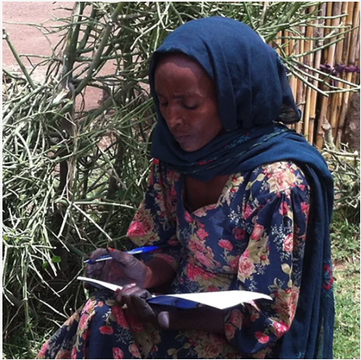

# Reported Rainfall timing in Village of Genete (Ethiopia)

In the village of Genete, we can perform this crosscheck.

We will use the timing of the season in decads, a common form for agronomists.  A decad reflects approximately 10 days from the new year, so decad 4 starts Feb 1, Decad 7 starts March 1, Decad 19 July 1, Decad 25 is September 1.

The quantitative focus group in Genete said that the key times they were vulnerable to rainfall were during flowering (late July and September) and preparation and planting, beginning in March and continuing into early July.

Below you can see the Rainfall climatology for the village, that is, the average rainfall during the year over their reported cropping cycle.  You can see bumps in the climatology plot during the two seasons common in this part of Ethiopia, the earlier Belg, and the later Kiremt seasons.  In some places these happen a long time apart, but on others they touch, or even merge, and the farmers make cropping choices for two seasons, or one long season depending on what seasonal timing they experience.

The most vulnerable times of year initially reported are higlighted in blue for the beginning of the year, and orange for the flowering, later in the year.  

To provide an additional verification source, green bar reflects the timing that the vegetation 
would change color to reflect seasonal end, after the rainfall in the time highlighted in orange had passed, and the landscape had time to respond.

There was intense discussion about if the most important start of the season was decad 7 or 18.

# Evaluating information and indexes

The chart below compares the bad years that the village reported with the years that had low rainfall in the satellite record, during the highlighted times just discussed.

* **Years** are listed on the **x axis**
* **Taller** bars are **worse** years, 
* **Grey** bars are the **farmer reported droughts**
* The **Tallest** grey bar is the **worst year** the village remembered

The satellite rainfall record is filtered by the farmer reported vulnerability timing

* The early season sowing (blue), late season flowering (orange), and vegetative de-greening (green) periods are the same colors as before

* the colored bars represent how bad the satellite rainfall was during those decads in each year

* There is an additional red bar that represents if any of the satellite metrics (the combined severity) reflected a bad year, which was used to design the insurance index.

* A red o marks any year where none of the satellite indicators were bad enough to be considered a meaningful deficit.

You can explore the agreement in the information.  Please answer the questions below:

