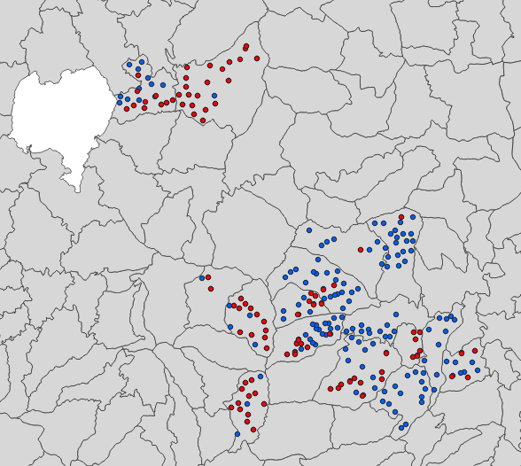

# Answers from Phone Feedback

The answers from the people who have completed the phone feedback "to date" (the day we wrote this part) can help us think through what to do next in the index design.

**Remember that the phone feedback is from folks going through this exercise, so it is not from the actual people who would be benefitting from the product. 
This is only a training example to show how this information could be used!**

But lets pretend the answers came from farmers, and community representatives...

The average answers were:

- 2002 50%
- 1984 50%

This illustrates that design is never easy!  Because were evenly split between wanting payouts in 2002 and 1984, it is still hard to make a choice, but could suggest that two different insurance products 
are what the community really wants.

But, we can dig deeper.  We can check the test question. If we assume that people who answered a test question "correctly" are giving more accurate answers, we can filter by that.  For our test question of which year was worse, 2009 or 2010 we believe 2009 is the correct answer.  

The respondents answered:

- 2009 62.5%
- 2010 37.5%

This means most people agreed with our belief.  We can use this to select people who we believe are answering more accurately.  We therefore do another attempt, where we calculate the responses of only the people who answered the test question "correctly".

Looking only at the people who answered the test question "correctly," we now have new results:

- 2002 80%
- 1984 20%

We could therefore select the design that focuses on the decads 10-17, based on the pretend farmer feedback from the participants of this illustration.  

Ironically, this is not so different from what the actual farmers themselves said when we asked the same question in the WFP led R4 project (in person, because it was a few years ago). 
In the actual R4 insurance project, many farmers wanted an index that was like the one in decads 6-17, because they wanted to de-risk loans for long cycle crops. 
The choice of early season vs later season start generally depended on the village, and was closely driven by how big the early seasonal "bump" in rainfall was. Across all of the villages polled that year, 57% chose the window that covered the later start, and 43% chose the earlier start window.  The red dots in the map at the bottom of this page are the villages that voted for the earlier start, and the blue dots are the ones who selected the delayed timing.

Having farmers provide low cost ongoing input like this, iterating over the years their situations change that leads to meaningful impacts and sustained demand for these villages over more than a decade.

