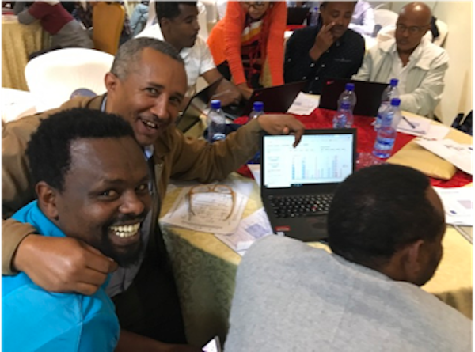

# Making sure satellite algorithms meet people's needs

Information from the ground is necessary to design models that meet peoples needs. 
These materials will guide you through an example of evaluating and improving a satellite index of drought.

## Client input is necessary for design

There are many things that the human or AI engineer does not know about the client's needs. For example, rainfall alone does not determine when a farmer can sow, or needs coverage to start. It is necessary to know what flexibility farmers have in crop types and labor availability to answer this question.

* Makes products that are better suited to clientelle
* [Improves demand](https://www.tandfonline.com/doi/full/10.1080/00220388.2018.1554207). Farmers who have had input on their products have more ownership and understanding.
* Reduces complaints. Products are more transparent, and many errors are discovered and addressed before failure happens.
* Improves accuracy. We have found that farmers themselves nearly universally design better indexes than provided by experts.
* Provides clientelle with voice and agency

